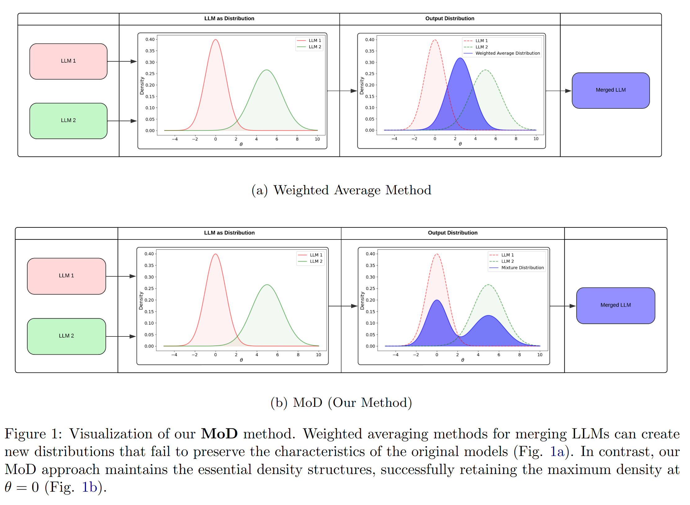

# Mixture of Distribution (MoD)

This repository contains the codebase for the paper [MoD: A Distribution-Based Approach for Merging Large Language Models](https://arxiv.org/abs/2411.00406).



*Large language models (LLMs) have enabled the development of numerous specialized, task-specific variants. However, the maintenance and deployment of these individual models present substantial challenges in terms of resource utilization and operational efficiency.
In this work, we propose the Mixture of Distributions (MoD) framework, a novel approach for merging LLMs that operates directly on their output probability distributions, rather than on model weights. Unlike traditional weight-averaging methods, MoD effectively preserves the specialized capabilities of individual models while enabling efficient knowledge sharing across tasks. Through extensive experimentation on mathematical reasoning benchmarks using Qwen2.5 models, we demonstrate that MoD significantly outperforms existing model merging techniques across multiple benchmarks.*

## Project Structure
- **configs**: Configuration files for running the program and evaluation phases.
- **mod**: Source code for the `mod` package.
- **scripts**: Scripts to execute the main MoD program and evaluation phases.
- **tests**: Test cases to validate functionality before release.

## Setup

To set up the environment and run the program, follow the steps below:

### 1. Create a Virtual Environment

Create a Python virtual environment and install the required dependencies.

```bash
python -m venv venv
source venv/bin/activate
pip install -r requirements.txt
```

### 2. Configure Hugging Face Token (Optional)

If certain resources from the Hugging Face Hub are required, configure your API token.

```bash
export HF_AUTH_TOKEN="YOUR_HF_TOKEN"
```

### 3. Run the Program

After setting up the environment and configurations, run the program with the provided script.

```bash
python ./scripts/mod.py --config ./configs/1.5B/mod_config.yml --out_path qwen2.5-1.5B-mod
```

## Evaluation

For evaluation, please refer to the instructions in the [mod-evaluate repository](https://github.com/knovel-eng/mod-evaluate).

## Testing

To ensure code integrity, create a pull request and run tests before pushing changes.

```bash
pip install pytest
pytest ./tests/
```

## Cite our Work
```
@misc{dang2024moddistributionbasedapproachmerging,
      title={MoD: A Distribution-Based Approach for Merging Large Language Models}, 
      author={Quy-Anh Dang and Chris Ngo},
      year={2024},
      eprint={2411.00406},
      archivePrefix={arXiv},
      primaryClass={cs.LG},
      url={https://arxiv.org/abs/2411.00406}, 
}
```